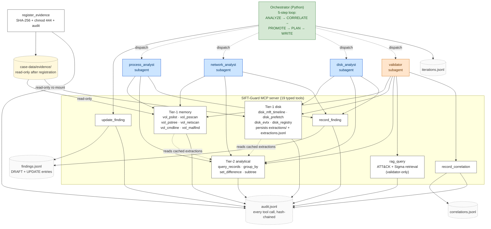

# SIFT-Guard

A turnkey autonomous DFIR appliance for the SANS SIFT Workstation
toolset (or any Linux host with Volatility 3 and the standard
SIFT disk-side tools installed).

A custom MCP server exposes typed, evidence-safe forensic tool
wrappers; analyst and validator subagents call those tools; a
plain-Python orchestrator drives a 5-step self-correction loop over
the resulting findings. Every action lands in one of four
hash-chained JSONL logs so any run is fully replayable from disk.

The differentiator: **autonomous iterative self-correction with
cross-validation**. The validator is its own subagent with a
deliberately-restricted tool surface (it can re-query the evidence
but cannot write findings); the orchestrator owns the promotion
rules; analyst subagents can be re-dispatched with focus context
across iterations until the finding set converges.

## Quick start

```bash
# Install on a SIFT VM (or any Linux host with Volatility 3 + SIFT
# disk tools on PATH).
pip install -e .

# Drop your evidence into a folder. SIFT-Guard scans, registers,
# and analyzes everything it recognizes.
sift-guard analyze /path/to/evidence/folder
```

That's the whole interface. The CLI:

1. Scans the directory and groups files by host using filename
   heuristics (`win10-nfury-mem.raw`, `nfury-disk.E01` →
   host_id `nfury`).
2. Prints the manifest table and waits 5 seconds for review
   (`--yes` to skip).
3. Copies evidence into the case directory and registers each file
   (SHA-256, `chmod 444`, audit-chain entry).
4. Probes each memory image's OS and symbol-pack availability.
5. Drives the multi-host self-correction loop.
6. Writes `report.md` + `report.json` next to the case chains.

## Architecture



See [`docs/architecture-diagram.md`](docs/architecture-diagram.md)
for the legend, the full 19-tool table by writer role, and the
loop narrative.

## Prerequisites

- **Linux host** with Volatility 3 installed (a SIFT Workstation
  2026.1 VM is the reference platform; a stock Ubuntu host with
  `pip install volatility3` works too).
- **Python 3.11+** for the SIFT-Guard MCP server itself.
  (SIFT 2026.1 ships Python 3.10 as the system interpreter; install
  3.11 via `apt`, `pyenv`, or `uv`. Volatility 3's own venv stays
  at whatever Python it shipped with — the runner detects it via
  the `vol` shebang line.)
- **[Claude Code CLI](https://docs.anthropic.com/en/docs/claude-code)**
  on PATH. The orchestrator dispatches analyst / validator subagents
  via `claude -p --agent <name>` and parses the stream-json output.
- **Anthropic API key** as `ANTHROPIC_API_KEY`. A typical multi-host
  run consumes a few hundred K to a few M uncached tokens.
- **Volatility symbol packs** matching the OS of the memory images
  you plan to analyze. Drop the unzipped Microsoft / Linux symbol
  archives into the directory pointed at by
  `VOLATILITY3_SYMBOL_DIRS` (or `volatility/symbols/`). The CLI's
  pre-flight probe surfaces a clear remediation message when a
  matching pack is missing.
- **Disk-side tools** (only required when analyzing disk images):
  `log2timeline.py` / `psort.py` (plaso), `evtx_dump.py`
  (python-evtx), `rip.pl` (RegRipper), `ewfmount` / `mount` /
  `guestmount`. SIFT 2026.1 ships all of these on PATH.
- **Optional RAG corpus** (~2 GB transitive deps for
  `sentence-transformers` + `faiss-cpu`). Required only for the
  validator's `rag_query` tool. Install with `pip install -e .[rag]`,
  then build the index: `python -m rag.build_index`.

## Installation

```bash
git clone https://github.com/chang6chang/SIFT-Guard.git
cd SIFT-Guard

# Create a venv. The `[rag]` extra is optional; skip if you don't
# need MITRE ATT&CK / Sigma retrieval inside the loop.
python3.11 -m venv .venv
source .venv/bin/activate
pip install -e ".[rag,dev]"

# Set the Anthropic API key.
export ANTHROPIC_API_KEY="sk-ant-..."

# Optional: build the RAG index (697 MITRE ATT&CK + 2147 SigmaHQ
# Windows rules = 2844 records, all-MiniLM-L6-v2 embeddings, FAISS).
# Pulls MITRE STIX + SigmaHQ tarball from GitHub at pinned tags.
python -m rag.build_index
```

## Usage

### One-shot analysis

```bash
sift-guard analyze /path/to/evidence/folder
```

Default behavior:

- Output directory: `./results-<UTC-timestamp>/`
- Max iterations: 6
- Token budget: 500K base + 250K per host (capped at 5M)
- Report formats: markdown + json

### Common flags

```bash
sift-guard analyze /path/to/evidence/folder \
    --output-dir ./case-001 \
    --max-iterations 8 \
    --token-budget 3000000 \
    --model claude-sonnet-4-20250514 \
    --yes                       # skip the 5-second review pause
```

```bash
# Preview the host grouping without registering anything.
sift-guard analyze /path/to/evidence/folder --scan-only

# Skip the OS / symbol-pack pre-flight probe.
sift-guard analyze /path/to/evidence/folder --no-preflight

# Drive the loop but skip report rendering at the end.
sift-guard analyze /path/to/evidence/folder --no-report
```

### Configuration file

```bash
sift-guard --config /etc/sift-guard.yaml analyze /path/to/evidence/folder
```

Auto-discovery order, first match wins:

1. `--config <path>`
2. `./sift-guard.yaml` (or `.yml`)
3. `~/.config/sift-guard.yaml`
4. `/etc/sift-guard.yaml`

A complete annotated example is in
[`sift-guard.yaml.example`](sift-guard.yaml.example):

```yaml
volatility:
  path: /usr/bin/vol            # omit to auto-detect via PATH
  symbols_dir: /opt/volatility3/volatility3/symbols/

disk_tools:
  log2timeline: /usr/bin/log2timeline.py
  evtx_dump: /usr/bin/evtx_dump.py
  regripper: /usr/bin/rip.pl

analysis:
  max_iterations: 6
  token_budget: 2000000
  model: claude-sonnet-4-20250514

output:
  dir: ./results
  generate_report: true
  report_format: both           # markdown | json | both
```

CLI flags always win over config values.

## Supported evidence types

The scanner recognizes recognized files by extension and refines
the type guess via magic bytes:

| Family | Extensions | Magic bytes |
|---|---|---|
| Memory image | `.raw`, `.mem`, `.lime`, `.vmem`, `.001` (with "memory" in filename) | `LiME` (LiME) |
| Disk image | `.E01`, `.dd`, `.img`, `.vhdx`, `.vhd`, `.vmdk`, `.qcow2`, `.vdi`, `.aff4` | `EVF\t\r\n\xff\x00` (E01), `vhdxfile` (VHDX), `KDMV` (VMDK), `QFI\xfb` (QCOW2), VirtualBox text header (VDI) |
| Registry hive | `.dat`, `.hve`, hive name | `regf` |
| Event log | `.evtx` | `ElfFile\x00` |
| PCAP | `.pcap`, `.pcapng` | `\xa1\xb2\xc3\xd4` / `\xd4\xc3\xb2\xa1` |
| Triage zip | `.zip` (KAPE / CyLR output) | `PK\x03\x04` |

Files outside this set are ignored. Files in `baseline/` /
`precooked/` subdirectories are also skipped — DFIR cases
conventionally place reference timelines and pristine OS images
there, neither of which the loop should re-register.

## Disk-image mounting

Disk images need to be mounted read-only before the disk-side
tools (plaso, RegRipper, evtx_dump) can run. SIFT-Guard offers two
modes:

1. **Operator pre-mount** (CI / containers / unprivileged hosts).
   Set `SIFT_DISK_PREMOUNTED_PATH=/mnt/sift_disk` (or
   `disk_tools.premounted_path` in the config). The mount utility
   skips every shell-out, validates `/proc/mounts` shows the path
   is read-only, and uses it as-is.

2. **Real shell-out** (production / SIFT VM with NOPASSWD sudo).
   The utility runs the format-specific mount commands
   (`ewfmount` for `.E01`, `mount -o ro,loop` for raw,
   `guestmount --ro` for VHDX). `/proc/mounts` is re-validated
   after every mount.

Either way, mounts are torn down at the end of the run.

## Output layout

After a run, the case directory looks like:

```
results-20260510T120000Z/
├── CASE.yaml                       # registration ledger
├── manifest.json                   # multi-host scan output
├── findings.jsonl                  # DRAFT + UPDATE entries
├── correlations.jsonl              # validator's correlation entries
├── iterations.jsonl                # one per loop iteration
├── extractions.jsonl               # tier-1 extraction provenance
├── audit/sift-guard-mcp.jsonl      # every tool call, hash-chained
├── extractions/<evidence_id>/      # cached Volatility outputs
├── evidence/<host>/<file>          # registered, chmod 444
├── report.md                       # human-readable
└── report.json                     # programmatic
```

The four hash-chained logs are the authoritative record. The
report is a rendering — re-running `python -m reporting.summary
<case_dir>` against the same chains is idempotent.

| Log | What to read it for |
|---|---|
| `findings.jsonl` | Per-finding timeline. Each `finding_id` has a DRAFT entry from an analyst plus zero-or-more UPDATE entries from the orchestrator. Last-write-wins reconstructs the final state + confidence. |
| `correlations.jsonl` | Validator reasoning. `evidence_refs` lists the tool-call audit lines (including `rag_query` ones) that back each correlation. |
| `iterations.jsonl` | Loop record. `termination_check` shows which of `R_a_zero_unresolved`, `R_b_disputed_set_unchanged`, `R_c_token_budget_exceeded`, or `max_iterations_reached` fired. |
| `audit/sift-guard-mcp.jsonl` | Every MCP tool call (success and rejection paths), hash-chained via `prev_line_hash` / `this_line_hash`. |

For the four confidence levels (LOW / MEDIUM / HIGH / DISPUTED)
and the six-rule R1-R6 promotion engine, see
[`docs/confidence-methodology.md`](docs/confidence-methodology.md).

## Evidence integrity guarantees

- `register_evidence` rejects any path outside `<case_dir>/evidence/`
  (sanitized message — never echoes the offending path).
- After registration, the file is `chmod 444` and its parent
  directory is `chmod 555`.
- Disk mounts are validated read-only via `/proc/mounts` before
  every read.
- Every tool call is captured in the hash-chained audit log
  (`prev_line_hash` / `this_line_hash`); tampering breaks every
  subsequent hash.
- MCP tools reject every absolute file path the agent might
  supply — they take only `evidence_id` handles minted at
  registration time.

These are architectural guarantees, not prompt rules. The MCP
server enforces them by construction; there is no
`execute_shell` / `run_command` tool, no path-taking tool, and
no way for the agent to widen the surface.

## Alternative transports

By default the local runner (`server/runners/local.py`) invokes
`vol` directly via subprocess. For split-VM dev setups (MCP server
on the developer's laptop, Volatility on a separate SIFT VM), the
SSH-based runner at `server/runners/ssh_remote.py` is still
available — point your tooling at it and set the
`SIFT_VM_HOST` / `SIFT_VM_USER` / `SIFT_VM_SSH_PORT` env vars.

## Troubleshooting

**`vol not found on PATH`.** Either install Volatility 3
(`pip install volatility3`), put `vol` on the host's PATH, or set
`SIFT_VOL_PATH=/absolute/path/to/vol`.

**`Missing Volatility symbols`.** The pre-flight probe ran
`windows.info.Info` (or `linux.info.Info`) against your image and
the symbol pack didn't match. Download the matching archive from
https://downloads.volatilityfoundation.org/volatility3/symbols/ and
unzip into `VOLATILITY3_SYMBOL_DIRS`.

**`Path outside evidence directory rejected`.** The
`register_evidence` tool refuses any path not under
`<case_dir>/evidence/`. The CLI handles this by copying the
evidence into the case directory before registration; if you
register manually, move the file into `<case_dir>/evidence/` first.

**`Permission denied` on evidence.** Files under
`<case_dir>/evidence/` are `chmod 444` and the parent directory is
`chmod 555` after registration — the architectural defense against
accidental modification. To re-register: `chmod 644` the file,
edit `CASE.yaml` to drop the prior entry, then re-run.

**MCP server won't start.** `python -m server.main` requires the
`mcp` package (auto-installed via `pip install -e .`). If it hangs
without a banner, check that stdio isn't being captured by another
process — the Claude Code CLI inherits stdio from the
orchestrator's subprocess invocation. `.mcp.json` paths are
absolute; if your venv lives at a non-standard location, update the
`command` and `cwd` fields.

**RAG index missing.** `rag_query` returns "RAG index missing
at …" when `rag/data/attack-enterprise.faiss` is absent. Run
`python -m rag.build_index` (network access to GitHub required for
the MITRE STIX bundle and SigmaHQ tarball).

## Documentation

| Doc | Purpose |
| --- | --- |
| [`docs/architecture-diagram.md`](docs/architecture-diagram.md) | The diagram + legend + tools table + V-C loop narrative. |
| [`docs/accuracy-report.md`](docs/accuracy-report.md) | Methodology for measuring per-run accuracy: chain-truth numbers, documented failure modes, confidence assessments. |
| [`docs/confidence-methodology.md`](docs/confidence-methodology.md) | Four confidence levels, three writer roles, six promotion rules R1-R6, worked examples from live chains. |
| [`docs/loop-design.md`](docs/loop-design.md) | The 5-step ANALYZE / CORRELATE / PROMOTE / PLAN / WRITE loop, termination flags, sequential-dispatch rationale. |
| [`docs/validator-design.md`](docs/validator-design.md) | V-C hybrid design choices; why the validator is a subagent (not a function), why it can re-query plugins, why it sees only DRAFT findings. |
| [`docs/adversarial-robustness.md`](docs/adversarial-robustness.md) | Threat model and layered defenses against attacker-controlled content in evidence-derived strings. |
| [`docs/synthetic-demo-image.md`](docs/synthetic-demo-image.md) | Construction of the synthetic adversarial image used by the regression demo. |
| [`docs/decisions-log.md`](docs/decisions-log.md) | Design rationale, deferred items, every architectural decision with date and reason. |
| [`server/runners/local.py`](server/runners/local.py) | Local Volatility 3 runner (the default). Auto-detects `vol` and the matching Python interpreter. |
| [`server/runners/ssh_remote.py`](server/runners/ssh_remote.py) | SSH-based alternative runner for split-VM setups. |
| [`server/runners/disk_mount.py`](server/runners/disk_mount.py) | Disk-mount utility, per-tool subprocess runners, parsers for plaso / prefetch / EVTX / RegRipper output. |
| [`orchestrator/inventory.py`](orchestrator/inventory.py) | Directory scanner + magic-byte detection + host-from-filename grouping heuristic. |
| [`reporting/summary.py`](reporting/summary.py) | Post-run report generator (markdown + json). |
| [`rag/SOURCES.md`](rag/SOURCES.md) | Per-corpus inventory: MITRE ATT&CK Enterprise (CC-BY 4.0) + SigmaHQ Windows rules (DRL 1.1), pinned tags, attribution rules. |

## License

[MIT](LICENSE).
