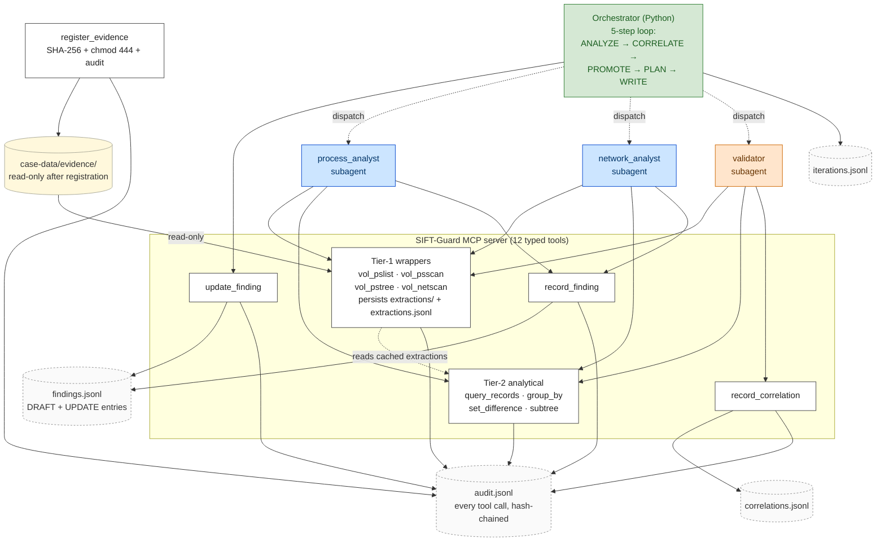

# SIFT-Guard

Autonomous DFIR agent built on the SANS SIFT Workstation toolset.
Submission for the SANS "Find Evil!" hackathon
([findevil.devpost.com](https://findevil.devpost.com/), deadline
15 June 2026).

A custom MCP server exposes typed, evidence-safe forensic tool
wrappers; analyst and validator subagents call those tools; a
plain-Python orchestrator drives a 5-step self-correction loop over
the resulting findings. Every action lands in one of four
hash-chained JSONL logs so any run is fully replayable from disk.

The differentiator vs. published reference submissions: **autonomous
iterative self-correction with cross-validation.** The validator is
its own subagent with a deliberately-restricted tool surface (it
can re-query the evidence but cannot write findings); the
orchestrator owns the promotion rules; analyst subagents can be
re-dispatched with focus context across iterations until the
finding set converges.

## Architecture

See [`docs/architecture-diagram.md`](docs/architecture-diagram.md)
for the legend, the 12-tool table by writer role, and the
loop-narrative writeup.

## Documentation

| Doc | Purpose |
| --- | --- |
| [`docs/architecture-diagram.md`](docs/architecture-diagram.md) | This diagram + legend + tools table + V-C loop narrative. |
| [`docs/confidence-methodology.md`](docs/confidence-methodology.md) | Four confidence levels, three writer roles, six promotion rules R1-R6, worked examples from the live chains. |
| [`docs/loop-design.md`](docs/loop-design.md) | The 5-step ANALYZE / CORRELATE / PROMOTE / PLAN / WRITE loop, termination flags, sequential-dispatch rationale. |
| [`docs/validator-design.md`](docs/validator-design.md) | V-C hybrid design choices; why the validator is a subagent (not a function), why it can re-query plugins, why it sees only DRAFT findings. |
| [`docs/adversarial-robustness.md`](docs/adversarial-robustness.md) | Threat model, layered defenses, demo on the synthetic injection-content image. |
| [`docs/synthetic-demo-image.md`](docs/synthetic-demo-image.md) | Construction of the synthetic adversarial image. |
| [`docs/decisions-log.md`](docs/decisions-log.md) | Design rationale, deferred items, every architectural decision with date and reason. |

## Status

Week 7 day 1. 361 unit tests + 4 deselected integration tests. End-
to-end runs validated on the SANS Standard Forensic Case (Rocba)
and on the synthetic adversarial-robustness demo image.

## License

[MIT](LICENSE).
