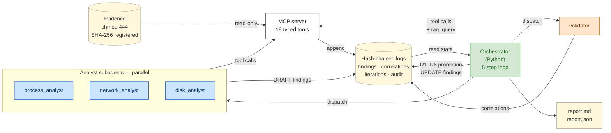
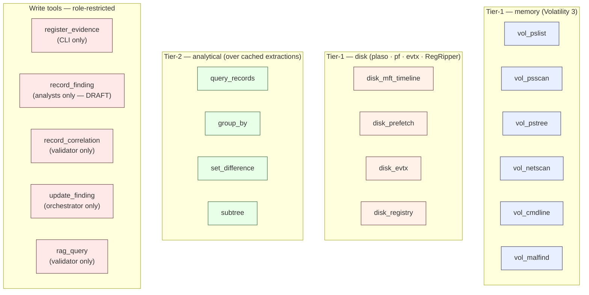

# Architecture diagram

SIFT-Guard is an autonomous DFIR agent for SANS' "Find Evil!" 2026
hackathon. A custom MCP server exposes typed, evidence-safe forensic
tool wrappers; analyst and validator subagents call those tools; a
plain-Python orchestrator drives a 5-step self-correction loop over
the resulting findings. Every action lands in one of four
hash-chained JSONL logs so any run is fully replayable from disk.

## The self-correction loop

### Stages

| # | Stage | Driver | What happens |
|---|---|---|---|
| 1 | **ANALYZE** | Orchestrator | Dispatches every applicable analyst subagent in parallel (ThreadPoolExecutor, default 12 workers, cross-process file locks on the chain writers). Each analyst reads its tier-1 + tier-2 tool surface and emits `DraftFinding` records via `record_finding`. |
| 2 | **CORRELATE** | Orchestrator | Dispatches one validator over the resulting DRAFT findings (host-grouped on multi-host runs). The validator can re-query every read tool plus `rag_query`, but cannot write findings — only correlations. Six correlation types: `corroborates`, `contradicts`, `strengthens`, `weakens`, `request_followup`, `cross_host`. |
| 3 | **PROMOTE** | Orchestrator (pure Python) | Applies the R1–R6 rule engine (`orchestrator/promotion.py`) to each correlation and emits `update_finding` calls. Promotes DRAFT → CONFIRMED on R3 strong corroboration (cross-source or cross-host); demotes to DISPUTED on unresolved contradictions; updates focus context on `request_followup`. |
| 4 | **PLAN** | Orchestrator | Evaluates four termination flags: `R_a_zero_unresolved` (no DRAFTs left), `R_b_disputed_set_unchanged` (stable stalemate across two iterations), `R_c_token_budget_exceeded`, `max_iterations_reached`. If none fires and follow-ups are pending, re-dispatches the requested analyst with `focus_context`. |
| 5 | **WRITE** | Orchestrator | Appends one record to `iterations.jsonl` with the termination check and per-analyst token/finding counts; on terminal iteration also writes `report.md` + `report.json` via `reporting/summary.py`. |

The loop is **deterministic given fixed model outputs**: the
promotion rules are pure functions, the termination check reads
only the chain state, and dispatch order is recorded. Every
iteration's full provenance is reconstructible from the four
hash-chained logs alone.

## MCP tool surface

### Caller restrictions, by tool

| Tool | Tier | Callers |
|---|---|---|
| `register_evidence` | bootstrap | CLI (idempotent on SHA-256 + chmod 444 state) |
| `vol_pslist` · `vol_psscan` · `vol_pstree` · `vol_netscan` | Tier-1 memory | `process_analyst`, `network_analyst`, `validator` |
| `vol_cmdline` · `vol_malfind` | Tier-1 memory | `process_analyst`, `validator` |
| `disk_mft_timeline` · `disk_prefetch` · `disk_evtx` · `disk_registry` | Tier-1 disk | `disk_analyst`, `validator` |
| `query_records` · `group_by` · `set_difference` · `subtree` | Tier-2 analytical | Every analyst + the validator |
| `rag_query` | Knowledge retrieval | `validator` only |
| `record_finding` | DRAFT writer | `process_analyst`, `network_analyst`, `disk_analyst` |
| `record_correlation` | Correlation writer | `validator` only |
| `update_finding` | Promotion writer | Orchestrator only |

Restrictions are enforced at three layers:

1. **Frontmatter** — each `.claude/agents/<role>.md` lists exactly
   the MCP tools the role is allowed to call. Claude Code's
   subagent dispatcher filters the visible tool surface to that
   list.
2. **Schema** — `server/schemas.py` constrains payloads via
   `Literal[...]` enums (e.g. `record_finding`'s `state` is
   `Literal["DRAFT"]` — an analyst cannot construct a CONFIRMED
   record).
3. **Server-side authorization** — write tools cross-check the
   caller's frontmatter role before accepting (e.g.
   `record_correlation` rejects calls whose `analyst` field is
   anything other than `"validator"` and audits a
   `record_correlation:rejected_wrong_role` line).

The four `disk_*` tools additionally gate on
`artifact_class == disk_image` from `CASE.yaml`; calling them on a
memory image audits a `<tool>:rejected_wrong_artifact_class` line
without invoking any subprocess.

## Storage model

| File | Writer | What's in it |
|---|---|---|
| `<case-dir>/CASE.yaml` | `register_evidence` | Per-evidence registration: SHA-256, registered timestamp, artifact_class, original path. The agent never reads this — it names evidence by `evidence_id`. |
| `<case-dir>/evidence/<host>/` | `register_evidence` | The evidence files themselves (chmod 444 originals + symlinks under `--no-copy` default, or deep-copied files under `--copy`). Read-only after registration; mount entries verified against `/proc/mounts`. |
| `<case-dir>/extractions/<evidence_id>/<plugin>.json` | Tier-1 tools | Cached full output from a Tier-1 plugin run (`vol_pslist` etc.). Each has a `.sha256` sidecar; an `extractions.jsonl` chain line records the mapping. Tier-2 tools read this cache rather than re-running Volatility. |
| `<case-dir>/findings.jsonl` | `record_finding` (DRAFT) + `update_finding` (UPDATE) | Per-finding timeline. Each `finding_id` has one DRAFT line + zero-or-more UPDATE lines. Last-write-wins reconstructs final state + confidence. |
| `<case-dir>/correlations.jsonl` | `record_correlation` | Validator output. Each entry carries `evidence_refs` listing the tool-call audit lines (including `rag_query` lines) that back the correlation. |
| `<case-dir>/iterations.jsonl` | Orchestrator | One record per loop iteration: dispatch list, findings/correlations added, promotions applied, termination_check, manifest_summary. |
| `<case-dir>/audit/sift-guard-mcp.jsonl` | Every MCP tool call | The master hash-chained audit. Every success and every typed rejection appends one line with `prev_line_hash` and `this_line_hash`. Tamper-evident across the four chain files. |

## Multi-host runs

Multi-evidence runs (`sift-guard analyze <evidence-dir>`) use the
same five-step loop via `run_loop_multi_host`, but the ANALYZE
stage dispatches every (host × analyst) pair as a single parallel
batch instead of a sequential walk. The `ThreadPoolExecutor` is
sized by `--parallel-max-workers` (default 12 — covers 4 hosts ×
3 analysts with no queueing); per-file `fcntl.flock` guards on the
chain writers serialize the actual append while allowing the
analyst dispatches themselves to run truly concurrently.

The validator sees host-grouped findings in one shared dispatch
(not per-host), so cross-host indicators — a shared IP, a binary
hash, a synchronized timestamp, a named MITRE TTP — can produce
`correlation_type="cross_host"` correlations naturally. Cross-host
correlations feed the existing R3 strong-corroboration promotion
path because hosts are independent sources by construction.

The `manifest_summary` field on each iteration record captures the
host count + per-host evidence counts so replay tooling can rebuild
the multi-host context from the chain alone.

## Sources of truth

Implementation files this diagram mirrors:

- `orchestrator/loop.py` — `run_loop` and `run_loop_multi_host`,
  the 5-step driver, the four termination flags, parallel dispatch.
- `orchestrator/dispatch.py` — `claude -p --agent` subprocess
  transport, stream-json parsing, MCP-attach verification, the
  per-agent schema-preload preamble.
- `orchestrator/promotion.py` — pure R1–R6 rule engine.
- `server/schemas.py` — three-writer chain schemas, closed-Literal
  payload constraints.
- `server/tools/{evidence,memory,disk,analytical,findings,correlations,rag}.py`
  — the 19 tool implementations.
- `server/runners/disk_mount.py` — disk-mount utility (always-sudo
  ewfmount/mount/umount, guestmount fallback,
  `SIFT_DISK_PREMOUNTED_PATH` override for CI).
- `.claude/agents/{process_analyst,network_analyst,disk_analyst,validator}.md`
  — per-subagent tool-surface restrictions.
- `docs/confidence-methodology.md` — what PROMOTE does in detail.
- `docs/decisions-log.md` — design rationale and deferred items.

If the diagram and the implementation ever drift, the
implementation wins; file a `docs/decisions-log.md` entry rather
than editing the code to match.
