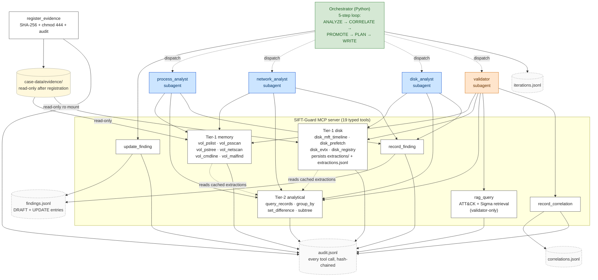

# Architecture diagram

SIFT-Guard is an autonomous DFIR agent for SANS' "Find Evil!" 2026
hackathon. A custom MCP server exposes typed, evidence-safe forensic
tool wrappers; analyst and validator subagents call those tools; a
plain-Python orchestrator drives a 5-step self-correction loop over
the resulting findings. Every action lands in one of four
hash-chained JSONL logs so any run is fully replayable from disk.

## Diagram

## Legend

| Element | Meaning |
| --- | --- |
| Blue boxes (`process_analyst`, `network_analyst`, `disk_analyst`) | Analyst subagents — write `DraftFinding` entries via `record_finding`. |
| Orange box (`validator`) | Validator subagent — writes correlation entries only; cannot mutate findings. |
| Green box (`Orchestrator`) | Plain Python (not an LLM). Drives the 5-step loop and is the sole writer of `update_finding` (DRAFT → CONFIRMED / DISPUTED). |
| White boxes inside the MCP-server subgraph | The 19 typed MCP tools, grouped by role. |
| Yellow cylinder | Read-only evidence storage (chmod 444 from registration). |
| Grey dashed cylinders | The four hash-chained JSONL chains. |
| Solid arrow `→` | A direct call or write. |
| Dashed arrow `⇢` | Control / cache flow (orchestrator dispatches subagents; tier-2 reads cached extractions). |

The architectural constraint is encoded in **which arrows are
absent**, not just which are present. There is no arrow from the
validator to `record_finding` or `update_finding`; no arrow from
the analysts to `record_correlation` or `update_finding`; no arrow
from the orchestrator to `record_finding` or `record_correlation`.
The frontmatter of each subagent
(`.claude/agents/{process,network,disk}_analyst.md` plus
`.claude/agents/validator.md`) restricts its visible tool
surface; the schema (`server/schemas.py`) restricts the
payloads it can construct; the audit chain captures every call
regardless.

## MCP tools by writer role

The 19 tools the MCP server exposes, grouped by what's allowed to
call them. Every successful invocation appends one line to
`audit.jsonl`; every rejection appends a typed `<tool>:rejected_*`
line.

| Tool | Tier | Allowed callers |
| --- | --- | --- |
| `register_evidence` | bootstrap | Any caller (idempotent on the registered file's SHA-256) |
| `vol_pslist` | Tier-1 (memory) | Any subagent + the orchestrator's MCP client |
| `vol_psscan` | Tier-1 (memory) | Any subagent + the orchestrator's MCP client |
| `vol_pstree` | Tier-1 (memory) | Any subagent + the orchestrator's MCP client |
| `vol_netscan` | Tier-1 (memory) | Any subagent + the orchestrator's MCP client |
| `vol_cmdline` | Tier-1 (memory) | `process_analyst` (frontmatter restriction) — fills the EPROCESS-only gap with user-space CommandLine strings |
| `vol_malfind` | Tier-1 (memory) | `process_analyst` (frontmatter restriction) — flags VAD regions whose protection is RWX and whose contents look like code |
| `disk_mft_timeline` | Tier-1 (disk) | `disk_analyst` (frontmatter restriction) — plaso MFT-only timeline (`log2timeline.py --parsers mft` + `psort.py -o json_line`) |
| `disk_prefetch` | Tier-1 (disk) | `disk_analyst` (frontmatter restriction) — Windows/Prefetch/*.pf parser; proves execution |
| `disk_evtx` | Tier-1 (disk) | `disk_analyst` (frontmatter restriction) — Security + System .evtx parser; cross-validates RDP brute-force / service-install patterns |
| `disk_registry` | Tier-1 (disk) | `disk_analyst` (frontmatter restriction) — RegRipper across SYSTEM / SOFTWARE / SAM / NTUSER.DAT |
| `query_records` | Tier-2 (analytical) | Any subagent + the orchestrator's MCP client |
| `group_by` | Tier-2 (analytical) | Any subagent + the orchestrator's MCP client |
| `set_difference` | Tier-2 (analytical) | Any subagent + the orchestrator's MCP client |
| `subtree` | Tier-2 (analytical) | Any subagent + the orchestrator's MCP client |
| `rag_query` | retrieval (RAG) | `validator` only (frontmatter restriction) — searches the merged ATT&CK + Sigma corpus |
| `record_finding` | finding writer | `process_analyst`, `network_analyst`, and `disk_analyst` only (DISPUTED self-mark rejected) |
| `record_correlation` | correlation writer | `validator` only |
| `update_finding` | promotion writer | The orchestrator only (DRAFT → DRAFT/CONFIRMED transitions) |

The four `disk_*` tools are gated by `artifact_class is disk_image`
inside their wrappers — calling them against a `memory_image`
evidence_id raises a sanitized `evidence is not a disk image` and
audits a `<tool>:rejected_wrong_artifact_class` line. The mount
utility (`server.runners.disk_mount.mount_disk_image`) is
internal to the server, NOT an MCP tool — the agent can only name
an `evidence_id`, never a path or a mount.

Tier-1 tools also persist the full Volatility output to
`case-data/extractions/<evidence_id>/<plugin>.json` (with a
`.sha256` sidecar) and append a chain line to `extractions.jsonl`.
Tier-2 tools never invoke Volatility — they read the cached
extractions and compose narrowed answers under a 10 KB
return-size budget.

## Data flow — the V-C self-correction loop in five sentences

The orchestrator's `run_loop()` reads the registered evidence's
`artifact_class` from `CASE.yaml` and dispatches the matching
analyst subagents (`process_analyst` + `network_analyst` for
memory images; `disk_analyst` for disk images / triage zips —
analysts run sequentially per the single-process audit-chain
writer constraint), each of which calls Tier-1 / Tier-2 tools
and commits its observations as DRAFT findings via
`record_finding`. The orchestrator then dispatches the
`validator` subagent with a summary of every DRAFT finding; the
validator independently calls the same tool surface and commits
observations as one of six correlation types via
`record_correlation` (`corroborates`, `contradicts`,
`strengthens`, `weakens`, `request_followup`, and `cross_host`
for multi-host runs where a shared indicator links findings
across host_ids). The orchestrator's PROMOTE step applies the
six-rule R1-R6 engine
(`orchestrator/promotion.py`,
documented in `docs/confidence-methodology.md`) per finding and
writes any non-R6 outcome via `update_finding`; cross_host
correlations feed the same R3 strong-corroboration path because
the two hosts are independent sources by construction. The PLAN
step computes the four termination flags
(`R_a_zero_unresolved`, `R_b_disputed_set_unchanged`,
`R_c_token_budget_exceeded`,
`max_iterations_reached`); if none fires and at least one
`request_followup` correlation is pending, the next iteration
dispatches the named analyst with the requested `focus_context`.
The WRITE step appends one record to `iterations.jsonl`, and the
loop terminates when any flag fires or no follow-up remains —
every iteration's full provenance is reconstructible from the
four hash-chained logs alone.

Multi-evidence runs (`python -m orchestrator.main run-case
--evidence-dir <path>`) follow the same five-step loop via
`run_loop_multi_host` but iterate per-host per-evidence: each
manifest host's evidence files dispatch their respective
analysts in turn, the validator sees host-grouped findings, and
the `manifest_summary` field on each iteration record captures
the host count + per-host evidence counts for replay.

## Sources

This diagram reflects what ships as of the
[`Closing-out` commit](../). It is consistent with:

- `orchestrator/loop.py` — the 5-step loop, dispatch, termination
- `orchestrator/promotion.py` — R1-R6 rule engine
- `server/schemas.py` — three-writer chain schemas + Literal
  constraints on payload values
- `server/tools/{evidence,memory,disk,analytical,findings,correlations,rag}.py`
  — the 19 tool implementations
- `server/runners/disk_mount.py` — disk-mount utility + per-tool
  subprocess runners + parsers; honors
  `SIFT_DISK_PREMOUNTED_PATH` for dev/CI environments without
  root
- `.claude/agents/{process,network,disk}_analyst.md` and
  `.claude/agents/validator.md` — the per-subagent tool-surface
  restriction (the architectural enforcement that makes
  "validator can't write findings" and "memory analysts can't
  call disk tools" true at the agent surface, not just at the
  schema)
- `docs/confidence-methodology.md` — what the loop's PROMOTE step
  does in detail
- `docs/loop-design.md`, `docs/validator-design.md`,
  `docs/decisions-log.md` — design rationale and deferred items

If the diagram and the implementation ever drift, the
implementation wins; file a `decisions-log.md` entry for triage
rather than editing the code to match.
